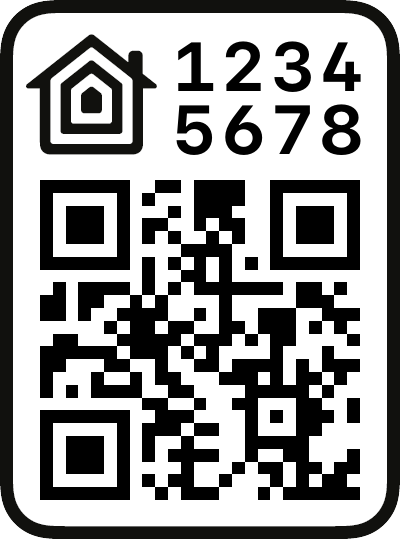

# HomeKit QR Code generator

This is a QR Code generator for DIY HomeKit enabled devices.


## Prerequisites

- `Python 3` installed


## Installation

- Clone this repository: `git clone https://github.com/gearbox/homekit-qrcode-generator.git`
- Go to the project directory: `cd homekit-qrcode-generator`
- Create virtual environment: `mkdir venv && python3 -m venv ./venv/`
- Activate virtual environment: `source ./venv/bin/activate`
- Update pip and setuptools that are installed in the venv: `pip install --upgrade pip setuptools`
- Install required packages: `pip install -r requirements.txt`


## Usage

```shell
(venv) foo@bar: homekit-qrcode-generator$ python gen_qrcode.py category password setup_id output_image_name
```

### Attributes description

1. 'category' - an integer, e.g. '`2`'
2. 'password' - static password string that corresponds to the regexp mask `\d{3}-\d{2}-\d{3}`, e.g. '`123-45-678`'.
3. 'setup_id' - a string that corresponds to the regexp `[0-9A-Z]{4}`, e.g. '`2K23`'.
4. 'output_image_name' - a string with a filename for the output image, e.g. '`qrcode-example.png`'


## Usage example

```shell
(venv) foo@bar: homekit-qrcode-generator$ python gen_qrcode.py 2 123-45-678 2K23 qrcode-example.png
```


